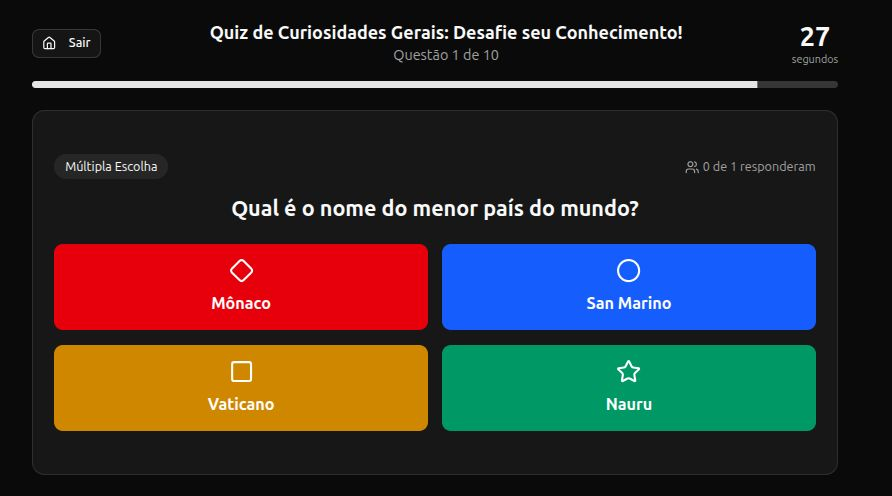
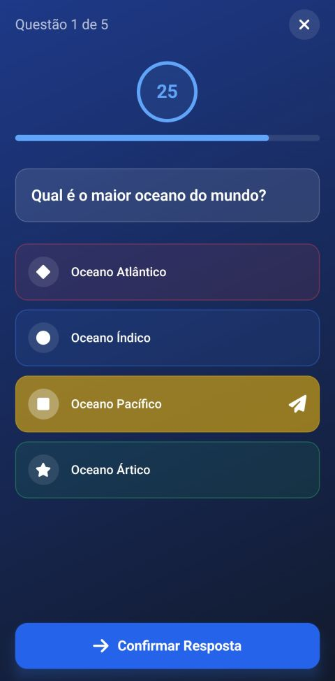
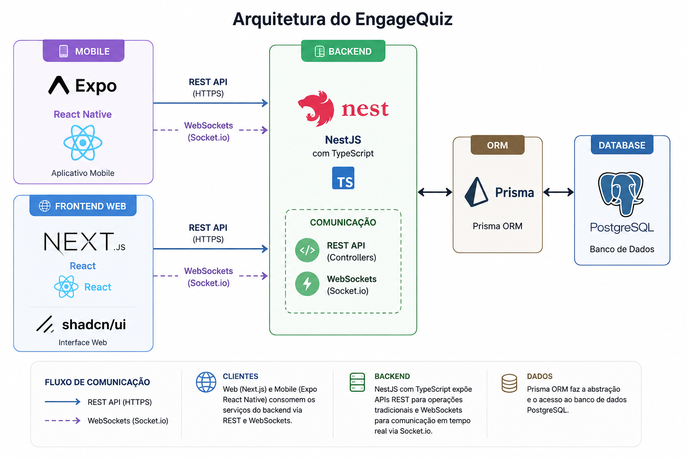

# EngageQuiz

  
  

Aplicação multiplataforma para criação e participação em quizzes em tempo real, projetada para engajar participantes em sala de aula ou eventos de forma interativa e dinâmica.

---

## 🎯 Funcionalidades

O EngageQuiz oferece uma experiência unificada para a criação e participação em questionários:

### Painel Web
* **Autenticação Segura:** Cadastro, login e logout com suporte a tokens JWT (Access e Refresh tokens).
* **Gestão de Quizzes:** Criação, edição, exclusão e geração assistida por IA de questionários.
* **Sessões em Tempo Real:** Iniciar sessões de jogo e controlar o avanço das perguntas.
* **Acompanhamento:** Visualização dos resultados e do desempenho em tempo real.

### Aplicativo Mobile
* **Autenticação & Acesso:** Login e cadastro com armazenamento seguro de credenciais.
* **Entrada nas Salas:** Ingressar em sessões ao vivo via código de acesso.
* **Interatividade:** Responder às perguntas em tempo real de seu próprio dispositivo.
* **Gamificação:** Feedback de desempenho e visão da classificação geral.

---

## 🏗️ Arquitetura e Tecnologias

O EngageQuiz é construído com tecnologias modernas, garantindo escalabilidade e performance.

### Por que um Monorepo?
Adotei a estrutura de **Monorepo** para manter todos os componentes da aplicação (backend, frontend web e app mobile) em um único lugar. Isso facilita o desenvolvimento, compartilhamento de conhecimentos e garante que as modificações fiquem sincronizadas entre os serviços.

### Tecnologias Principais
* **Backend:** [NestJS](https://nestjs.com/) com TypeScript, Prisma ORM, JWT (Passport) e PostgreSQL. Comunicação via REST e WebSockets (Socket.io).
* **Frontend Web:** [Next.js](https://nextjs.org/) (React) com Tailwind CSS, Server Actions e componentes da ShadcnUI.
* **Mobile:** [React Native](https://reactnative.dev/) com [Expo](https://expo.dev/) e `expo-secure-store`.

---

## 📂 Estrutura do Repositório

| Diretório | Descrição | Link para o README interno |
| :--- | :--- | :--- |
| `backend/` | API REST e servidor WebSocket que gerencia questionários, sessões, autenticação e banco de dados. | [🔗 Ver README do Backend](./backend/README.md) |
| `web/` | Painel web para criação, gerenciamento e condução de questionários ao vivo. | [🔗 Ver README da Web](./web/README.md) |
| `mobile/` | Aplicativo mobile para participação em questionários ao vivo em tempo real. | [🔗 Ver README do Mobile](./mobile/README.md) |

---

## 🚀 Pré-requisitos Gerais

Para rodar o projeto localmente, você precisará de:
* [Node.js](https://nodejs.org/) (versão LTS recomendada, ex: 18+ ou 20+)
* Um gerenciador de pacotes (npm, yarn ou pnpm)
* [PostgreSQL](https://www.postgresql.org/) (rodando localmente ou via Docker)
* [Expo Go](https://expo.dev/go) instalado em seu smartphone para testar o app mobile, ou um emulador (Android Studio / Xcode).

> **Atenção:** As configurações de variáveis de ambiente (`.env`) e os comandos de execução específicos estão detalhados no README de cada diretório.

---

## 🗺️ Roadmap

- [x] Implementar autenticação segura com suporte a JWT Access & Refresh tokens.
- [x] Testes Automatizados no Backend (Auth, Quizzes, Sessions, Gateway WebSocket).
- [ ] Dashboards e relatórios detalhados de desempenho.
- [ ] Novos tipos de questão.
