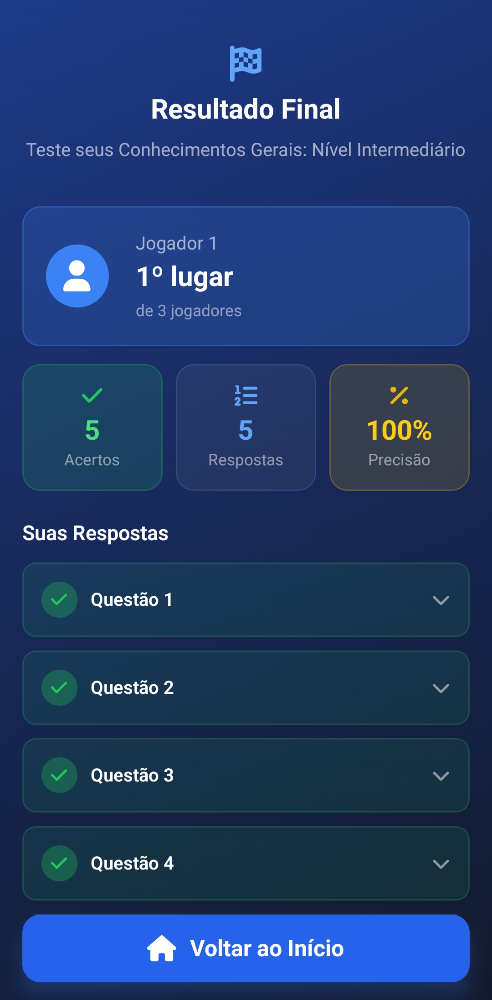

# EngageQuiz - Mobile (App dos Alunos)

Esta pasta contém o **Aplicativo Mobile** do EngageQuiz. O app é projetado para os alunos participarem dos quizzes criados pelos professores. Através de autenticação ou código de sala, eles ingressam na sessão, respondem as perguntas em tempo real de seus smartphones e acompanham a sua pontuação.

<p align="center">
  
  
</p>

---

## 🛠️ Tecnologias Específicas

* **[React Native](https://reactnative.dev/):** Framework para criar o aplicativo nativo para Android e iOS utilizando React e JavaScript/TypeScript.
* **[Expo](https://expo.dev/):** Plataforma e framework em volta do React Native que facilita o desenvolvimento, build e deploy do aplicativo (utilizando o Expo Router para navegação).
* **[expo-secure-store](https://docs.expo.dev/versions/latest/sdk/securestore/):** Armazenamento criptografado no hardware do dispositivo (iOS Keychain e Android KeyStore/EncryptedSharedPreferences).
* **[NativeWind](https://www.nativewind.dev/):** Utilizado para estilizar os componentes React Native usando classes do Tailwind CSS.
* **[Zustand](https://docs.pmnd.rs/zustand/):** Gerenciador de estado global pequeno, rápido e escalável. Usado para manter o estado de autenticação e da sessão de jogo sincronizados.
* **[Socket.io-client](https://socket.io/):** Biblioteca para a comunicação via WebSockets, recebendo do servidor o avanço das perguntas e atualizando a tela do aluno instantaneamente.

---

## 🔐 Autenticação & Armazenamento Seguro

A integração com o módulo de autenticação no app móvel foi projetada focando na segurança nativa:

* **Armazenamento Seguro (`expo-secure-store`):**
  * Em vez de `AsyncStorage` (que salva dados em texto não criptografado), os tokens de acesso e de refresh (`accessToken` e `refreshToken`) são persistidos de forma segura e criptografada pelo sistema operacional (Keychain / KeyStore).
* **Silent Refresh & Interceptador HTTP (`lib/api.ts`):**
  * O cliente Axios anexa automaticamente o cabeçalho `Authorization: Bearer <accessToken>`.
  * Em caso de resposta `401 Unauthorized` por expiração do Access Token (15 minutos), o interceptador renova silenciosamente os tokens via `/auth/refresh` usando o `refreshToken` do `SecureStore` sem deslogar o aluno.
* **Navegação Protegida no Expo Router (`app/_layout.tsx`):**
  * O layout raiz observa o estado do `useAuthStore`. Usuários não autenticados são redirecionados automaticamente para as telas de login/cadastro (`(auth)`), enquanto alunos autenticados avançam para a entrada de salas (`/join`).

---

## ⚙️ Pré-requisitos e Configuração

Certifique-se de que o [Backend](../backend/README.md) esteja rodando. O aplicativo mobile precisa se conectar à API REST para autenticação e ingressar nas salas via WebSocket.

**Atenção:** Se você for rodar o aplicativo no seu dispositivo físico (via Expo Go), certifique-se de que o smartphone e o computador onde o backend está rodando estão na **mesma rede**.

### Variáveis de Ambiente

Crie um arquivo `.env` na raiz da pasta `mobile/`:

```env
# URL da API REST e WebSocket do Backend.
# IMPORTANTE: Não use "localhost" se for testar num dispositivo físico, 
# use o IP da sua máquina na rede local
EXPO_PUBLIC_API_URL="http://192.168.x.x:3000"
```

---

## 🚀 Executando o Projeto

1. **Instale as dependências:**
   ```bash
   npm install
   # ou yarn install / pnpm install
   ```

2. **Inicie o servidor do Expo:**
   ```bash
   npm start
   # ou npm run android / npm run ios
   ```

3. **Testando o Aplicativo:**
   * **No smartphone (Recomendado):** Baixe o aplicativo "Expo Go" na Google Play ou App Store. Com o aplicativo aberto, escaneie o QR Code que aparecerá no terminal.
   * **No Emulador:** Caso tenha o Android Studio ou o Xcode configurados com emuladores, basta pressionar a tecla `a` (para Android) ou `i` (para iOS) no terminal após rodar `npm start`.

---

## 📜 Scripts Disponíveis

* `npm start`: Inicia o empacotador (Metro Bundler) do Expo.
* `npm run android`: Inicia o Expo já tentando abrir um emulador Android conectado.
* `npm run ios`: Inicia o Expo já tentando abrir o simulador do iOS (apenas Mac).
* `npm run web`: Roda o aplicativo no navegador (útil apenas para testes pontuais).

---

## 🏗️ Peculiaridades

* **Expo Router:** A navegação do app é baseada em arquivos (`app/`), similar ao Next.js.
* **Zustand Stores:**
  * `useAuthStore.ts`: Gerencia autenticação, verificação de token inicial e ciclo de vida do login/logout.
  * `useSessionStore.ts`: Gerencia a conexão Socket.io da sessão ativa do quiz e eventos de tempo real.
