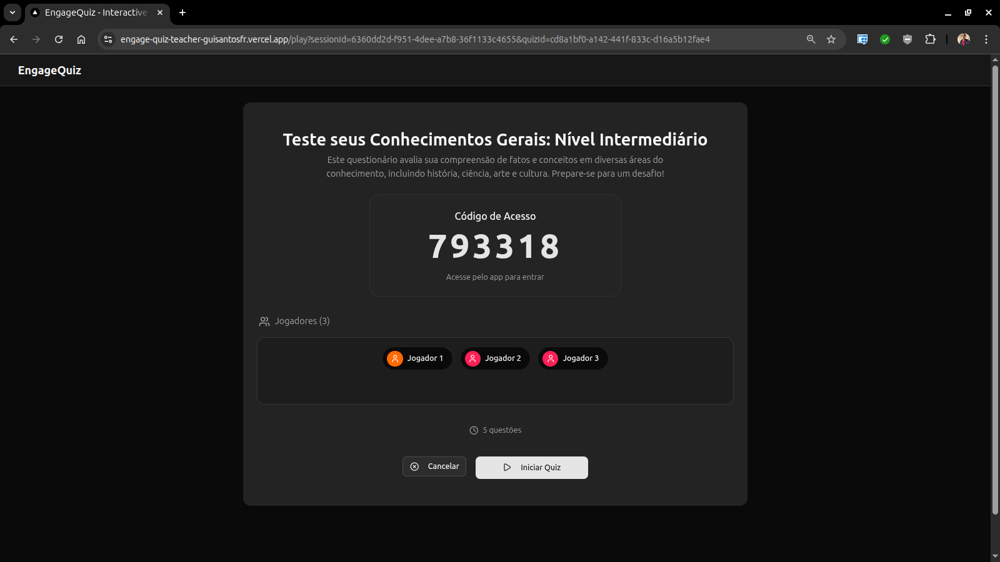
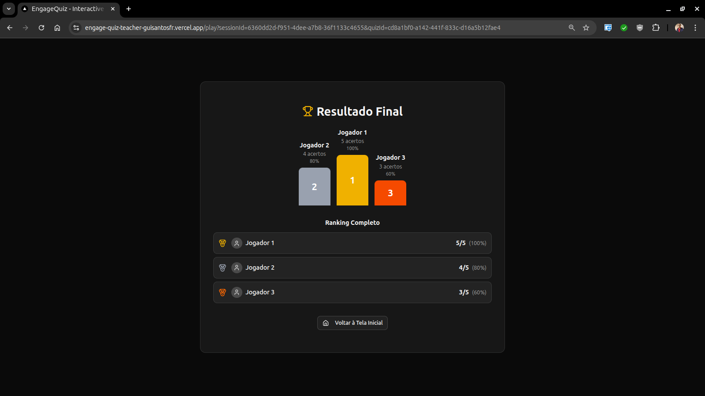

# EngageQuiz - Web

Esta pasta contém o **Frontend Web** do EngageQuiz. Trata-se da plataforma web utilizada para a criação de quizzes (incluindo geração por IA), visualização de resultados e gerenciamento das sessões de jogo em tempo real.

<p align="center">
  
  
  
</p>

---

## 🛠️ Tecnologias Específicas

* **[Next.js (App Router)](https://nextjs.org/):** Framework React utilizado para a construção da interface, garantindo renderização rápida e boa arquitetura de pastas.
* **[React](https://react.dev/):** Biblioteca para a construção das interfaces de usuário.
* **[Tailwind CSS](https://tailwindcss.com/):** Framework utilitário de CSS para estilização rápida e responsiva.
* **[Shadcn/UI](https://ui.shadcn.com/):** Coleção de componentes reutilizáveis construídos sobre o Radix UI, garantindo acessibilidade e um visual moderno.
* **[Socket.io-client](https://socket.io/):** Utilizado para a comunicação em tempo real com o servidor (ex: ver os jogadores entrando na sala, ver resultados ao vivo).
* **[jwt-decode](https://github.com/auth0/jwt-decode):** Decodificação de tokens JWT para obtenção e validação rápida da sessão do usuário.

---

## 🔐 Autenticação & Segurança no Frontend

A integração com o módulo de autenticação do backend adota práticas modernas de segurança no Next.js:

* **Server Actions (`app/_actions/auth-actions.ts`):**
  * `loginAction`: Comunica-se com o backend e define cookies HTTP seguros.
  * `registerAction`: Realiza o cadastro de novos usuários.
  * `logoutAction`: Remove os cookies de sessão de forma limpa.
  * `getAuthUser`: Recupera os dados do usuário conectado através da decodificação segura do JWT.
* **Gestão Segura de Tokens (Cookies HttpOnly):**
  * Os tokens (`accessToken` e `refreshToken`) são mantidos exclusivamente em cookies HTTP com flags `HttpOnly`, `Secure` e `SameSite=Lax`. Isso impede o acesso por scripts maliciosos injetados no DOM (proteção contra **XSS**).
* **Proteção de Rotas (Proxy/Middleware):**
  * O Middleware do Next.js intercepta as requisições antes do render. Usuários não autenticados tentando acessar áreas privadas são redirecionados automaticamente para `/login`.

---

## ⚙️ Pré-requisitos e Configuração

Certifique-se de que o [Backend](../backend/README.md) esteja rodando, pois a plataforma web precisa se comunicar com a API REST e o servidor WebSocket.

### Variáveis de Ambiente

Crie um arquivo `.env.local` na raiz da pasta `web/`:

```env
# URL da API REST e WebSocket do Backend
NEXT_PUBLIC_API_URL="http://localhost:3000"
```
*(Altere a porta caso o seu backend esteja rodando em uma porta diferente).*

---

## 🚀 Executando o Projeto

1. **Instale as dependências:**
   ```bash
   npm install
   # ou yarn install / pnpm install
   ```

2. **Inicie o servidor de desenvolvimento:**
   ```bash
   npm run dev
   ```

3. Abra o navegador em [http://localhost:3000](http://localhost:3000) (ou a porta indicada no terminal, ex: `3001` caso a `3000` esteja em uso pelo backend).

---

## 📜 Scripts Disponíveis

* `npm run dev`: Inicia a aplicação em modo de desenvolvimento.
* `npm run build`: Cria a versão otimizada para produção.
* `npm run start`: Inicia a aplicação construída (requer que o `build` tenha sido rodado antes).

---

## 🏗️ Peculiaridades

* **Server Actions:** Mutações e buscas de dados são feitas no lado do servidor Next antes de chamar a API NestJS, centralizando a manipulação de tokens e garantindo segurança.
* **Painel da Sessão:** A tela de execução de uma sessão ativa abre uma conexão via WebSocket com o backend para coordenar qual pergunta está ativa e atualizar a interface conforme os participantes respondem.
